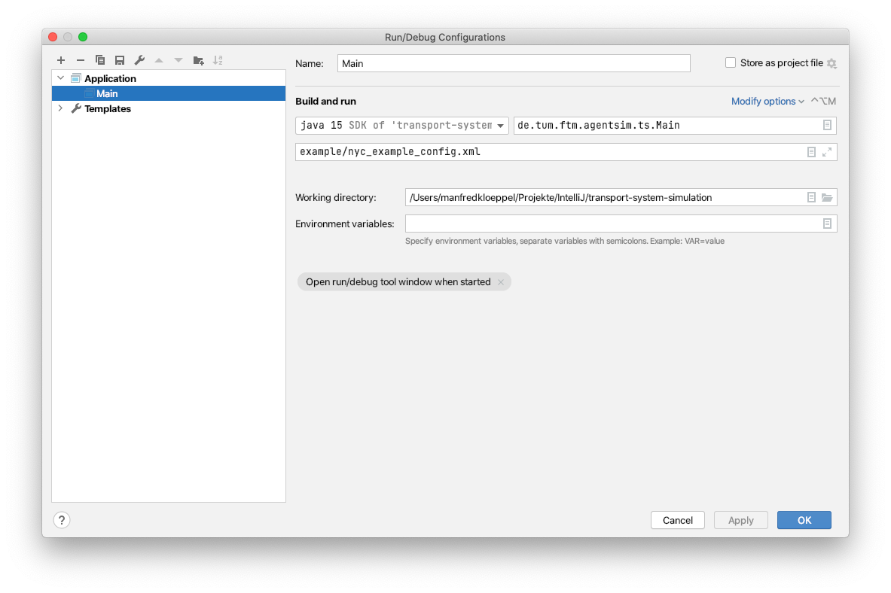
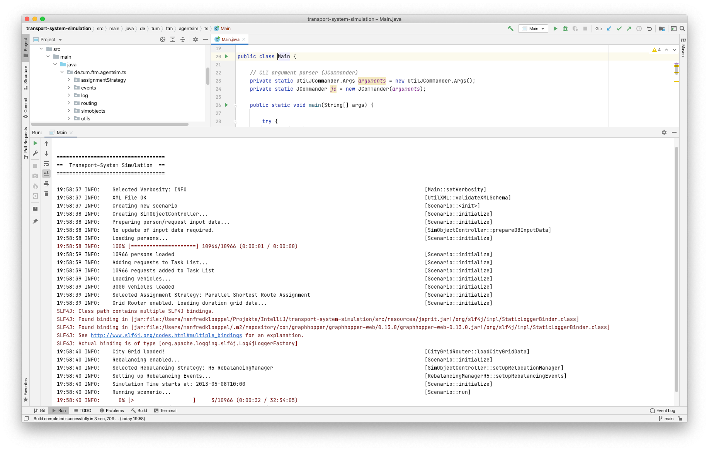

# Transport System Simulation

This is the documentation. Runs on Windows, Linux, macOS.
## Initial Setup
1. IntelliJ -> File -> New -> Project from Version Control -> Insert URL "https://github.com/TUMFTM/transport-system-simulation.git" 
2. Setup [SQLite & Spatialite](/docs/sqlite_spatialite.md)
3. Setup [jSprit](/docs/jsprit.md)
4. Setup [Project Folders & Artifact](/docs/intellij_config.md)
5. Right-click on "pom.xml" -> Maven -> Reload project (also helps, if Graphhopper/jSprit log-messages appear)
6. Project should build successfully

## Simulation Preparation
Before running a simulation, the configuration-file needs to be configured. Following data is required for a simulation:
- Configuration-File (*.xml)
- Vehicle data (*.csv)
- Request data (*.sqlite)
- Rebalancing data (*.json)
- OSM map data (*.osm.pbf, e.g. from geofabrik.org)

Exemplary input data is provided in [examples](/examples). Adjust the paths to the files accordingly to your system. Example scenario takes approx. 5-10 minutes to execute (tested on 3 GHz 6-Core Intel Core i5).

## Run Simulation
### Parameters
```
Usage: transport-system-simulation.jar [options] CONFIG-FILE
  Options:
    -te, --timeend
      Simulation end time. Format: -te 'YYYY-MM-DD_HH:MM'
      Default: <empty string>
    -ts, --timestart
      Simulation start time. Format: -ts 'YYYY-MM-DD_HH:MM'
      Default: <empty string>
    -v, --verbose
      Level of verbosity (TRACE, DEBUG, INFO, WARNING, ERROR)
      Default: INFO
    -c, --xsd
      Path to XSD-File
      Default: config.xsd
```
### IntelliJ
Create configuration to run the simulation:
1. IntelliJ -> Run -> Edit Configurations -> Add
2. Insert Name, class and arguments as follows:

3. Run


### Console
```
java -Xmx4g -jar transport-system-simulation.jar example/nyc_example_config.xml
```


