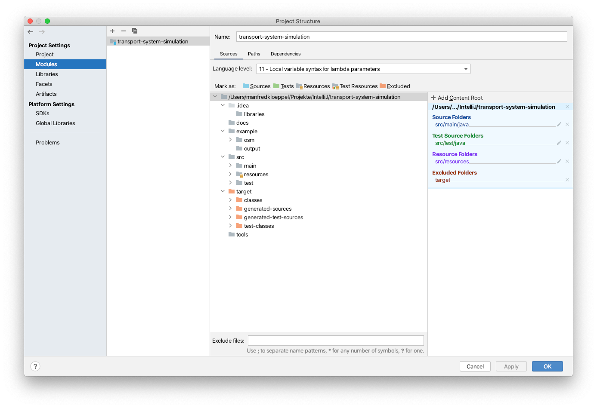
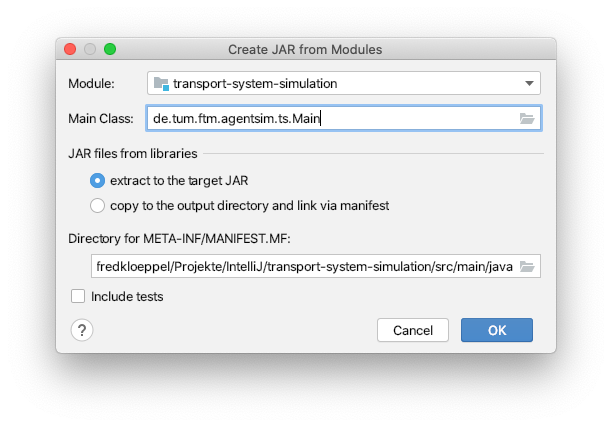
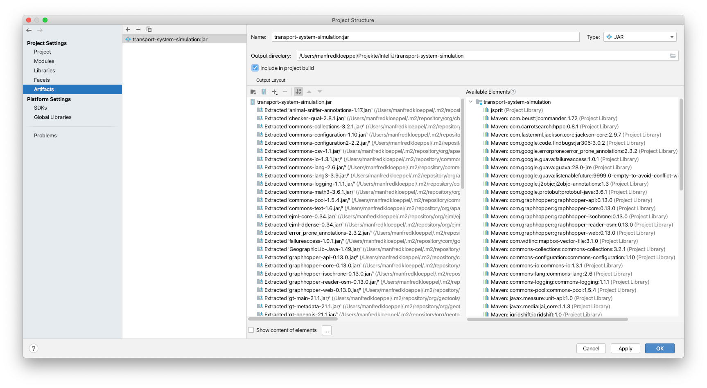

# Setup IntelliJ Project Folder & Artifact
Setup of the project folder is required to suppress log-messages from GraphHopper and jSprit by configuration of log4j (resources/log4j2.xml). Artifact configuration creates a jar-file of the simulation for remote execution (e.g. lrz cluster).

## Project folder setup
IntelliJ -> File -> Project Structure -> Modules

## Artifact setup
1. IntelliJ -> File -> Project Structure -> Artifacts
2. Add -> JAR -> From module with dependencies -> fill in "Main Class" -> OK

3. Tick "Include in Project build"
4. Optional: Change path to project root

