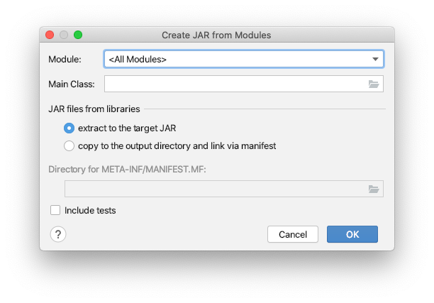
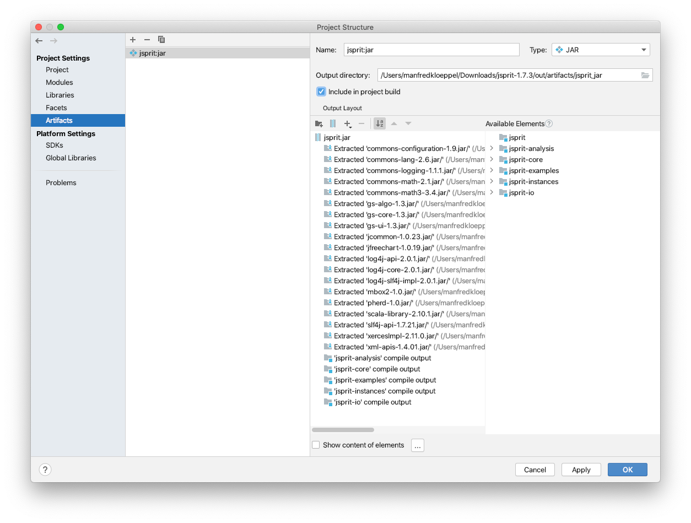

# jSprit Setup
The transport system simulation uses the jSprit-Framework for solving of VRPs. The version 1.7.3 is used. The following steps explain how to compile and include jSprit into the transport system simulation.

## Build jSprit
1. Get sources (v 1.7.3) from [jSprit-Git](https://github.com/graphhopper/jsprit)
2. IntelliJ -> File -> New -> Project from existing sources -> Select the downloaded folder jsprit-1.7.3 -> Import Project from external model -> Maven
3. IntelliJ -> File -> Project Structure -> Artifacts -> Click the "Plus"-Symbol (Add) -> JAR -> From module with dependencies -> OK

4. Tick the box "Include in project build" -> OK

5. Build -> Build Project -> File "jsprit.jar" is built in "Output directory"
6. Optional: Copy "jsprit.jar" to the location of the transport system simulation

## Include jSprit in Transport System Simulation
1. Open "Transport System Simulation" project in IntelliJ
2. IntelliJ -> File -> Project Structure -> Modules -> Add -> Select previously compiled "jsprit.jar" file -> Open -> OK
3. Build project

