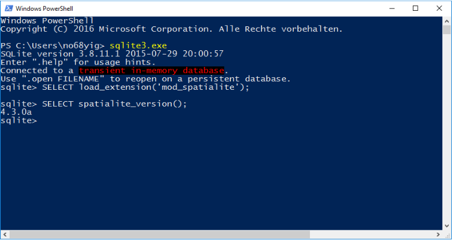

# SpatiaLite
Spatialite is a extension for SQLite to support Spatial SQL: https://www.gaia-gis.it/fossil/libspatialite/index

SpatiaLite Reference: http://www.gaia-gis.it/gaia-sins/spatialite-sql-4.3.0.html

The following instructions use the spatialite-binaries available at: https://github.com/fulcrumapp/spatialite-bin

## Windows
The instructions makes both the 32-bit and the 64-bit version of Spatialite available on your system, so any application can use the version they need.
1. Unzip and put BOTH folders to a place where they can stay permanently (e.g. "C:
\Spatialite\ia32" AND "C:\Spatialite\x64"):
```
    ../lib/win/ia32
    ../lib/win/x64
```
2. Make 64-bit and 32-bit Version of Spatialite available on the system:
```
    Run CMD.exe as administrator and enter following commands:
    Mklink /D C:\windows\system32\spatialite C:\spatialite\x64
    Mklink /D C:\windows\syswow64\spatialite C:\spatialite\ia32
```
3. Edit environment variables: Add "C:\windows\system32\spatialite" to PATH
4. Open Windows Powershell twice, once as 64-bit and once as 32-bit and check the Spatialite version:
```
  Sqlite3.exe
  SELECT load_extension('mod_spatialite');
  SELECT spatialite_version();

  Result should be: 64-bit: 4.3.0a, 32-bit: 4.3.0
```


## macOS / Linux
Copy mod_spatialite.dylib (macOS)/ mod_spatialite.so (Linux) to somewhere convenient :) Specify the full path to the file whenever needed

(macOS: If you want to use Spatialite with Python, download Python from Python.org, which seems to allow the  "sqlite_load_extension" command)